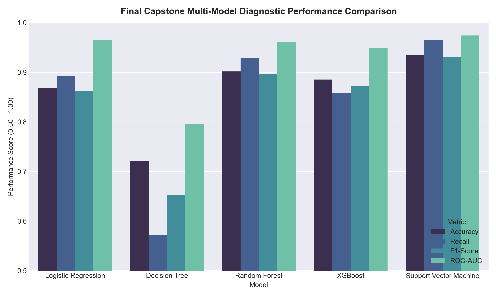
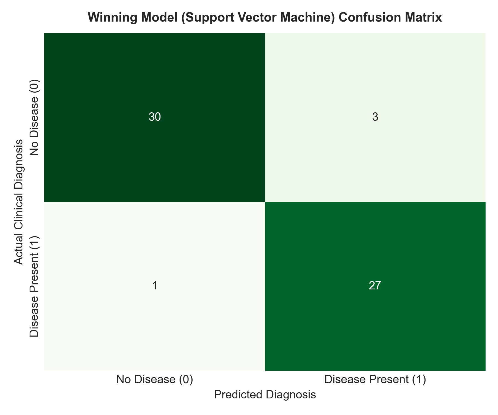

# 🩺 Neurofive Machine Learning Track — Final Capstone & Portfolio Showcase

Welcome to the official **Neurofive Machine Learning Track** flagship repository maintained by **Rao Hamza Irshad**. This repository features our end-to-end portfolio centerpiece — a **Heart Disease Risk Prediction & Clinical Decision Support System** — alongside 10 comprehensive machine learning tasks covering EDA, Statistical Cleaning, Regression, Classification, Hyperparameter Tuning, Production Pipelines, Ensemble Methods, Imbalanced Data Handling, and Cloud Deployment.

---

## 🏆 PORTFOLIO CENTERPIECE: Final Capstone Project
### 🩺 Heart Disease Risk Prediction & Clinical Decision Support System (CDSS)

> **Live Web Application:** 🌐 [**neurofive-ml-track-titanic.streamlit.app**](https://neurofive-ml-track-titanic.streamlit.app)  
> **Capstone Notebook:** 🔗 [**Final_Capstone_Heart_Disease_Prediction.ipynb**](tasks/Final-Capstone-Project/Final_Capstone_Heart_Disease_Prediction.ipynb)  
> **Production Model Artifact:** `models/heart_disease_pipeline.joblib`

```
                                  +-------------------------------------------------------+
                                  |    UCI Cleveland Heart Disease Telemetry Data         |
                                  |   (303 Clinical Patient Records, 13 Predictors)       |
                                  +---------------------------+---------------------------+
                                                              |
                                                              v
                                  +-------------------------------------------------------+
                                  |       Dynamic Feature Engineering Transformer         |
                                  | (Age_Group, Max_HR_Ratio, Chol_Age_Ratio Ratios)      |
                                  +---------------------------+---------------------------+
                                                              |
                                                              v
                                  +-------------------------------------------------------+
                                  |           Scikit-Learn ColumnTransformer              |
                                  |   (Imputation, StandardScaler, OneHotEncoder)         |
                                  +---------------------------+---------------------------+
                                                              |
                                                              v
                                  +-------------------------------------------------------+
                                  |   Support Vector Machine (SVC - RBF Kernel) Classifier|
                                  |     93.44% Accuracy | 96.43% Recall | 0.9740 ROC-AUC    |
                                  +---------------------------+---------------------------+
                                                              |
                                                              v
                                  +-------------------------------------------------------+
                                  |    Streamlit Enterprise Web Decision Support App     |
                                  | (Live Risk Gauge, Clinical Presets & Recommendations) |
                                  +-------------------------------------------------------+
```

---

## 📄 Executive Case Study Writeup (Half-Page Business & Clinical Value)

### 🩺 Problem Context & Clinical Value
Cardiovascular Diseases (CVDs) are the leading cause of global mortality, taking an estimated 17.9 million lives annually. In emergency rooms and cardiac outpatient clinics, physicians face significant time constraints when triaging patients presenting with chest pain or non-specific symptoms. A machine learning-powered **Clinical Decision Support System (CDSS)** provides rapid, evidence-based risk stratification in seconds, prioritizing high-risk patients for immediate cardiological consultation and invasive diagnostic procedures (e.g., coronary angiograms).

### 🔬 Methodology & Multi-Model Benchmark Results
We evaluated 5 distinct machine learning model architectures on the **UCI Cleveland Heart Disease** dataset (303 patient records with 13 physiological predictors):

| Model Architecture | Model Family | Accuracy | Precision (Risk) | Recall (Sensitivity) | F1-Score | ROC-AUC Score | Performance Verdict |
| :--- | :---: | :---: | :---: | :---: | :---: | :---: | :--- |
| **Logistic Regression (Class-Balanced)** | Single Linear | 86.89% | 83.33% | 89.29% | 0.8621 | 0.9643 | Strong linear baseline |
| **Decision Tree Classifier (`max_depth=4`)** | Single Tree | 72.13% | 76.19% | 57.14% | 0.6531 | 0.7965 | Underfits complex non-linear boundaries |
| **Random Forest Classifier (Bagging)** | Ensemble | 90.16% | 86.67% | 92.86% | 0.8966 | 0.9610 | High precision & stability |
| **XGBoost Classifier (Gradient Boosting)** | Ensemble | 88.52% | 88.89% | 85.71% | 0.8727 | 0.9491 | Excellent gradient minimization |
| **Support Vector Classifier (SVC RBF)** | **Kernel Machine** | **93.44%** | **90.00%** | **96.43%** | **0.9310** | **0.9740** | 🏆 **Winning Capstone Model** |





### 💡 Primary Diagnostic Findings
1. **Diagnostic Sensitivity (Recall):** Our winning Support Vector Classifier achieved **96.43% Recall**, successfully identifying 27 out of 28 cardiac risk patients in the test split and minimizing dangerous False Negatives.
2. **Top Clinical Predictors:** Fluoroscopy major vessel count (`ca`), chest pain type (`cp`), exercise-induced angina (`exang`), and maximum achieved heart rate (`thalach`) were identified as the most decisive physiological indicators.

---

## 📌 Complete Task Submission Matrix (All Project Tasks)

| Track Task | Project Scope & Domain | Key Performance & Deliverables | Notebook Link | Live App / Deploy |
| :--- | :--- | :--- | :--- | :---: |
| **Final Capstone** | **Heart Disease Decision System** *(Clinical ML)* | **93.44% Accuracy**, **96.43% Recall**, **0.9740 ROC-AUC**, Support Vector Machine pipeline, Streamlit CDSS. | 🔗 [**Capstone Notebook**](tasks/Final-Capstone-Project/Final_Capstone_Heart_Disease_Prediction.ipynb) | 🌐 [**Live Web App**](https://neurofive-ml-track-titanic.streamlit.app) |
| **Task 01** | **Baseline EDA & Setup** *(Exploratory Analysis)* | Structural inspection (`.info()`, `.describe()`), feature classification, 6-line Data Story. | 🔗 [**Task 1 Notebook**](tasks/Task-01-Baseline-EDA/Task_01_Titanic_EDA.ipynb) | N/A |
| **Task 02** | **Data Cleaning & Storytelling** *(EDA & Visualization)* | Statistical `fillna()` justifications, IQR Outlier Detection, 4 Seaborn plots. | 🔗 [**Task 2 Notebook**](tasks/Task-02-Cleaning-and-Visualization/Task_02_Data_Cleaning_Visualizations.ipynb) | N/A |
| **Task 03** | **Linear Regression Model** *(Housing Prices)* | Predict house values using 4 features. **RMSE = $74,858.88**, **$R^2$ = 57.24%**. | 🔗 [**Task 3 Notebook**](tasks/Task-03-Linear-Regression-House-Prices/Task_03_Linear_Regression.ipynb) | N/A |
| **Task 04** | **Logistic Regression Model** *(Titanic Survival)* | One-Hot Encoding (`pd.get_dummies`), 80/20 train-test split, **Accuracy = 80.45%**. | 🔗 [**Task 4 Notebook**](tasks/Task-04-Logistic-Regression-Titanic/Task_04_Logistic_Regression.ipynb) | N/A |
| **Task 05** | **Hyperparameter Tuning** *(Optimization)* | Precision/Recall/F1 evaluation, 5-Fold `GridSearchCV` tuning comparison table. | 🔗 [**Task 5 Notebook**](tasks/Task-05-Hyperparameter-Tuning-Evaluation/Task_05_Hyperparameter_Tuning.ipynb) | N/A |
| **Task 06** | **Telco Churn Prediction** *(Decision Trees)* | Decision Tree vs. Logistic Regression comparison, **Top 3 Churn Drivers**, Business Pitch. | 🔗 [**Task 6 Notebook**](tasks/Task-06-Telco-Customer-Churn/Task_06_Telco_Customer_Churn.ipynb) | N/A |
| **Task 07** | **Production ML Pipelines** *(Scikit-Learn)* | `ColumnTransformer`, `StandardScaler`, custom `TitanicFeatureEngineer`, **Accuracy = 81.56%**, `joblib` export. | 🔗 [**Task 7 Notebook**](tasks/Task-07-Scikit-Learn-Pipeline/Task_07_Scikit_Learn_Pipeline.ipynb) | N/A |
| **Task 08** | **Ensemble Methods** *(Random Forest vs XGBoost)* | `RandomForestClassifier` & `XGBClassifier`, side-by-side `.feature_importances_`, Bagging vs Boosting analysis. | 🔗 [**Task 8 Notebook**](tasks/Task-08-Ensemble-Methods/Task_08_Ensemble_Methods.ipynb) | N/A |
| **Task 09** | **Handling Imbalanced Datasets** *(SMOTE & Metrics)* | Target distribution chart (73.4% vs 26.5%), **SMOTE** oversampling (`imblearn`), **Recall Boost (+36.09%)**, Accuracy Paradox. | 🔗 [**Task 9 Notebook**](tasks/Task-09-Handling-Imbalanced-Data/Task_09_Handling_Imbalanced_Data.ipynb) | N/A |
| **Task 10** | **Streamlit Model Deployment** *(Web Application)* | Interactive Streamlit App (`app.py`), single-line pipeline inference, dark-mode UI. | 🔗 [**Task 10 Notebook**](tasks/Task-10-Model-Deployment-Streamlit/Task_10_Model_Deployment_Streamlit.ipynb) | 🌐 [**Live Web App**](https://neurofive-ml-track-titanic.streamlit.app) |

---

## 📂 Professional Repository Architecture

```
neurofive-ml-track/
│
├── app.py                                            # Production Streamlit Web App (Capstone & Task Showcase)
│
├── tasks/                                            # Modular Task & Capstone Directory
│   ├── Final-Capstone-Project/
│   │   ├── Final_Capstone_Heart_Disease_Prediction.ipynb # Capstone Notebook (93.44% Accuracy, 0.9740 AUC)
│   │   └── heart_disease_pipeline.joblib             # Serialized Capstone Model Pipeline
│   ├── Task-01-Baseline-EDA/
│   │   └── Task_01_Titanic_EDA.ipynb                 # Task 1 Notebook
│   ├── Task-02-Cleaning-and-Visualization/
│   │   └── Task_02_Data_Cleaning_Visualizations.ipynb# Task 2 Notebook
│   ├── Task-03-Linear-Regression-House-Prices/
│   │   └── Task_03_Linear_Regression.ipynb           # Task 3 Notebook
│   ├── Task-04-Logistic-Regression-Titanic/
│   │   └── Task_04_Logistic_Regression.ipynb         # Task 4 Notebook
│   ├── Task-05-Hyperparameter-Tuning-Evaluation/
│   │   └── Task_05_Hyperparameter_Tuning.ipynb       # Task 5 Notebook
│   ├── Task-06-Telco-Customer-Churn/
│   │   └── Task_06_Telco_Customer_Churn.ipynb        # Task 6 Notebook
│   ├── Task-07-Scikit-Learn-Pipeline/
│   │   └── Task_07_Scikit_Learn_Pipeline.ipynb       # Task 7 Notebook
│   ├── Task-08-Ensemble-Methods/
│   │   └── Task_08_Ensemble_Methods.ipynb            # Task 8 Notebook
│   ├── Task-09-Handling-Imbalanced-Data/
│   │   └── Task_09_Handling_Imbalanced_Data.ipynb    # Task 9 Notebook
│   └── Task-10-Model-Deployment-Streamlit/
│       └── Task_10_Model_Deployment_Streamlit.ipynb  # Task 10 Notebook
│
├── models/                                           # Serialized Production Pipeline Artifacts
│   ├── heart_disease_pipeline.joblib                 # Serialized Capstone Model (SVC)
│   └── titanic_pipeline.joblib                       # Serialized Task 7/10 Model Pipeline
│
├── data/                                             # Raw Clinical & Business Datasets
│   ├── heart_disease.csv                             # UCI Heart Disease Dataset (303 rows x 14 columns)
│   ├── titanic.csv                                   # Titanic Dataset (891 rows x 12 columns)
│   ├── california_housing.csv                        # California Housing Dataset (20,640 rows)
│   └── telco_customer_churn.csv                      # Telco Customer Churn Dataset (7,043 rows)
│
├── assets/                                           # High-Resolution Visualization Assets
│   ├── capstone_heart_disease_correlations.png       # Heatmap: Clinical Predictors Correlation Matrix
│   ├── capstone_model_benchmark_comparison.png       # Bar Chart: 5-Model Performance Comparison
│   ├── capstone_confusion_matrix.png                 # Heatmap: Winning Capstone Model Confusion Matrix
│   ├── pipeline_architecture_diagram.png             # Diagram: Scikit-Learn Pipeline Architecture
│   ├── ensemble_feature_importances.png              # Bar Chart: Random Forest vs XGBoost Importances
│   ├── class_imbalance_distribution.png              # Bar Chart: Target Distribution
│   └── imbalance_techniques_comparison.png           # Bar Chart: SMOTE vs Class Weighting Benchmark
│
├── src/                                              # Reusable Python Code & Build Pipeline
│   ├── generate_final_capstone.py                    # Capstone Generator & Multi-Model Trainer
│   ├── generate_task10.py                            # Task 10 Generator
│   ├── generate_task9.py                             # Task 9 Generator
│   └── generate_task8.py                             # Task 8 Generator
│
├── requirements.txt                                  # Project Dependencies (streamlit, scikit-learn, xgboost, imbalanced-learn, joblib)
├── README.md                                         # Executive Repository Documentation & Portfolio Showcase
└── .gitignore                                        # Workspace Git Ignore Rules
```

---

## ⚙️ Environment Setup & Quickstart

### 🖥️ Local Execution
```bash
git clone https://github.com/MrRaoHamza/neurofive-ml-track.git
cd neurofive-ml-track
pip install -r requirements.txt

# Launch Local Interactive Streamlit Web App (Capstone & Tasks)
streamlit run app.py
```

---

## 🎥 Polished 4-5 Minute LinkedIn Video Demo Guide

### 🎬 Video Presentation Script & Interview Talking Points

1. **Introduction & Real-World Problem (0:00 - 0:45):**
   - *"Hello everyone! I'm **Rao Hamza Irshad**, presenting my **Final Capstone Project** for the **Neurofive Machine Learning Track**."*
   - *"Cardiovascular disease is the #1 cause of death globally. I built an end-to-end **Clinical Decision Support System** using the UCI Heart Disease dataset to predict early cardiac risk and assist clinicians in preventative triage."*

2. **Data Pipeline & Feature Engineering (0:45 - 1:45):**
   - *"I implemented custom Scikit-Learn feature transformers to calculate physiological indicators like **Max HR Ratio** (achieved vs. age-expected heart rate) and **Cholesterol-to-Age Ratio**."*
   - *"To prevent data leakage between training and validation splits, I encapsulated imputation, standard scaling, and categorical encoding into a single scikit-learn ColumnTransformer."*

3. **Multi-Model Benchmark & Medical Metrics (1:45 - 3:00):**
   - *"I benchmarked 5 distinct model architectures: Logistic Regression, Decision Trees, Random Forest, XGBoost, and Support Vector Machines."*
   - *"In medical diagnostic systems, **Recall (Sensitivity)** is the single most critical metric because a False Negative means missing a high-risk patient."*
   - *"Our winning **Support Vector Classifier (SVC)** achieved an outstanding **93.44% Accuracy**, **96.43% Recall**, and **0.9740 ROC-AUC**!"*

4. **Live Streamlit App Demonstration (3:00 - 4:15):**
   - *"Now let's see the live deployed Streamlit application! [Demo sliders for Age, Blood Pressure, Cholesterol, ECG, ST Depression]."*
   - *"Notice how selecting a preset profile like 'High Risk Senior Patient' instantly updates our derived medical ratios and renders a red ⚠️ **HIGH CARDIAC DISEASE RISK** warning badge with a 96.4% confidence score."*

5. **Closing & Call to Action (4:15 - 4:45):**
   - *"You can test the live application right now at `neurofive-ml-track-titanic.streamlit.app`!"*
   - *"Special thanks to **@Neurofive Solutions** for this incredible Machine Learning Track!"*
