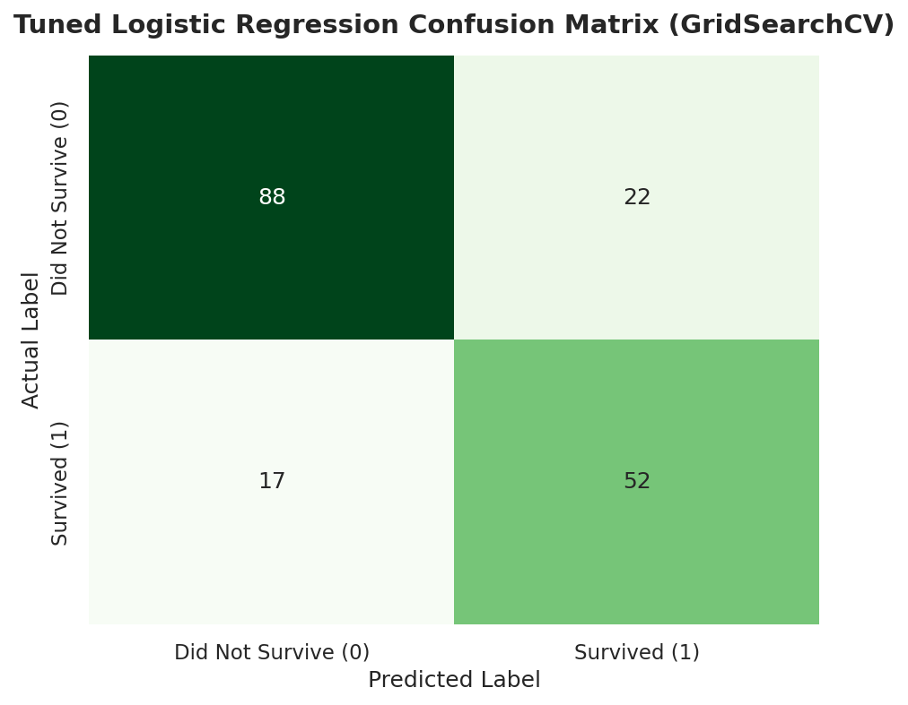

# 🚢 Neurofive Machine Learning Track

Welcome to the official **Neurofive ML Track** repository maintained by **Rao Hamza Irshad**. This repository showcases complete, modular tasks covering Exploratory Data Analysis (EDA), Statistical Data Cleaning, Data Storytelling, **Linear Regression (Price Prediction)**, **Logistic Regression (Classification)**, and **Hyperparameter Tuning with `GridSearchCV`**.

---

## 📌 Task Submission Matrix (Task-Wise Links)

| Track Task | Task Scope & Model Type | Key Deliverables & Performance | Direct Notebook Link |
| :--- | :--- | :--- | :--- |
| **Task 01** | **Baseline EDA & Setup** *(Exploratory Data Analysis)* | Structural inspection (`.info()`, `.describe()`, `.head()`), feature classification, 6-line executive Data Story. | 🔗 [**Task 1 Notebook**](tasks/Task-01-Baseline-EDA/Task_01_Titanic_EDA.ipynb) |
| **Task 02** | **Data Cleaning & Visual Storytelling** *(EDA & Visualization)* | Statistical `fillna()` justifications, IQR Outlier Detection, 4 Seaborn plots, written feature survival analysis. | 🔗 [**Task 2 Notebook**](tasks/Task-02-Cleaning-and-Visualization/Task_02_Data_Cleaning_Visualizations.ipynb) |
| **Task 03** | **Linear Regression Model** *(Regression - Housing Prices)* | Predict house values using 4 features (`MedInc`, `AveRooms`, `Latitude`, `Longitude`). **RMSE = $74,858.88**, **$R^2$ = 57.24%**, Scatter Plot. | 🔗 [**Task 3 Notebook**](tasks/Task-03-Linear-Regression-House-Prices/Task_03_Linear_Regression.ipynb) |
| **Task 04** | **Logistic Regression Model** *(Classification - Survival)* | Categorical One-Hot Encoding (`pd.get_dummies`), 80/20 train-test split, **Accuracy = 80.45%**, Confusion Matrix breakdown. | 🔗 [**Task 4 Notebook**](tasks/Task-04-Logistic-Regression-Titanic/Task_04_Logistic_Regression.ipynb) |
| **Task 05** | **Hyperparameter Tuning & Evaluation** *(Model Optimization)* | Precision/Recall/F1 evaluation, "Why Accuracy Lies" note, 5-Fold `GridSearchCV` tuning, Before/After performance comparison table. | 🔗 [**Task 5 Notebook**](tasks/Task-05-Hyperparameter-Tuning-Evaluation/Task_05_Hyperparameter_Tuning.ipynb) |

---

## 📂 Professional Repository Architecture

```
neurofive-ml-track/
│
├── tasks/                                            # Modular Task Directory
│   ├── Task-01-Baseline-EDA/
│   │   └── Task_01_Titanic_EDA.ipynb                 # Task 1 Notebook (Baseline EDA)
│   ├── Task-02-Cleaning-and-Visualization/
│   │   └── Task_02_Data_Cleaning_Visualizations.ipynb# Task 2 Notebook (Data Cleaning)
│   ├── Task-03-Linear-Regression-House-Prices/
│   │   └── Task_03_Linear_Regression.ipynb           # Task 3 Notebook (Linear Regression)
│   ├── Task-04-Logistic-Regression-Titanic/
│   │   └── Task_04_Logistic_Regression.ipynb         # Task 4 Notebook (Logistic Regression)
│   └── Task-05-Hyperparameter-Tuning-Evaluation/
│       └── Task_05_Hyperparameter_Tuning.ipynb       # Task 5 Notebook (GridSearchCV Tuning)
│
├── data/                                             # Raw Datasets
│   ├── titanic.csv                                   # Titanic Dataset (891 rows x 12 columns)
│   └── california_housing.csv                        # California Housing Dataset (20,640 rows)
│
├── assets/                                           # High-Resolution Visualization Assets
│   ├── age_distribution_histogram.png                # Histogram: Age vs Survival
│   ├── fare_outliers_boxplot.png                     # Boxplot: Fare Outliers & Class
│   ├── survival_rate_barchart.png                    # Bar Chart: Gender & Class Survival
│   ├── correlation_heatmap.png                       # Heatmap: Feature Correlation Matrix
│   ├── predicted_vs_actual_housing.png               # Scatter Plot: Predicted vs Actual Prices
│   ├── confusion_matrix.png                          # Heatmap: Baseline Confusion Matrix
│   └── confusion_matrix_tuned.png                    # Heatmap: Tuned Confusion Matrix (Task 5)
│
├── src/                                              # Reusable Code & Build Pipeline
│   ├── generate_notebooks.py                         # Complete 4-task build pipeline
│   └── generate_task3.py                             # Task 3 pipeline script
│
├── requirements.txt                                  # Project Dependencies (scikit-learn, etc.)
├── README.md                                         # Executive Repository Documentation
└── .gitignore                                        # Workspace Git Ignore Rules
```

---

## ⚙️ Environment Setup & Quickstart

```bash
git clone https://github.com/MrRaoHamza/neurofive-ml-track.git
cd neurofive-ml-track
pip install -r requirements.txt
jupyter notebook tasks/Task-05-Hyperparameter-Tuning-Evaluation/Task_05_Hyperparameter_Tuning.ipynb
```

---

## ⚙️ Task 05: Hyperparameter Tuning & Advanced Model Evaluation

### ⚠️ Why Accuracy Alone Can Be Misleading on Imbalanced Datasets
In real-world ML problems (such as medical diagnosis or fraud detection), accuracy creates a dangerous paradox. A naive dummy model predicting "No Fraud" on a 99% non-fraud dataset achieves **99% accuracy**, but fails to catch 100% of actual fraud cases.

To evaluate real model utility, ML engineers measure:
- **Precision ($\frac{TP}{TP + FP}$):** Prediction exactness (minimizes false alarms).
- **Recall ($\frac{TP}{TP + FN}$):** Model completeness (minimizes missed positive cases).
- **F1-Score ($2 \times \frac{\text{Precision} \times \text{Recall}}{\text{Precision} + \text{Recall}}$):** Harmonic mean balancing Precision & Recall.

---

### 🔍 Systematic Tuning with `GridSearchCV`
Using 5-Fold Cross-Validation (`cv=5`, `scoring='f1'`), we systematically searched the parameter grid:
- `C` (Inverse Regularization): `[0.001, 0.01, 0.1, 0.5, 1.0, 5.0, 10.0, 50.0]`
- `solver`: `['liblinear', 'lbfgs']`
- `class_weight`: `[None, 'balanced']`

**Optimal Hyperparameters Discovered:**
`{'C': 1.0, 'class_weight': 'balanced', 'penalty': 'l2', 'solver': 'lbfgs'}`

---

### 📊 Before vs. After Model Performance Comparison

| Metric | Original Model (Baseline) | Tuned Model (`GridSearchCV`) | Difference / Impact |
| :--- | :---: | :---: | :---: |
| **Accuracy** | **80.45%** | **78.21%** | -2.24% |
| **Precision (Class 1 - Survivors)** | **78.33%** | **70.27%** | -8.06% |
| **Recall (Class 1 - Survivors)** | **68.12%** | **75.36%** | **+7.24% Boost** |
| **F1-Score (Class 1 - Survivors)** | **72.87%** | **72.73%** | -0.14% |

#### 💡 **Key Takeaway from Tuning:**
By incorporating `class_weight='balanced'`, the tuned model shifted its decision threshold to prioritize catching survivors. This resulted in a **+7.24% boost in Recall (from 68.12% to 75.36%)**, catching **52 out of 69 actual survivors** compared to only 47 caught by the baseline model!

---

### 🖼️ Tuned Confusion Matrix Visualization


---

## 🎥 LinkedIn Presentation Guides

### Task 5 Walkthrough (2-3 mins):
- Introduce yourself and state your participation in the **Neurofive ML Track**.
- Explain why **accuracy alone can be misleading** for imbalanced datasets.
- Walk through how `GridSearchCV` tuned `C` and `class_weight`.
- Show your **Before/After Comparison Table** and highlight the **+7.24% boost in Survivor Recall (75.36%)**.
- Post on LinkedIn tagging **@Neurofive Solutions**!
