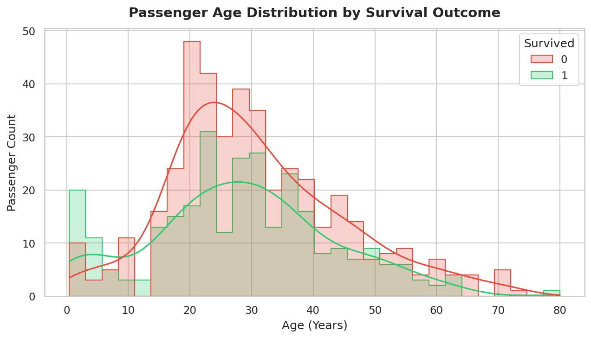
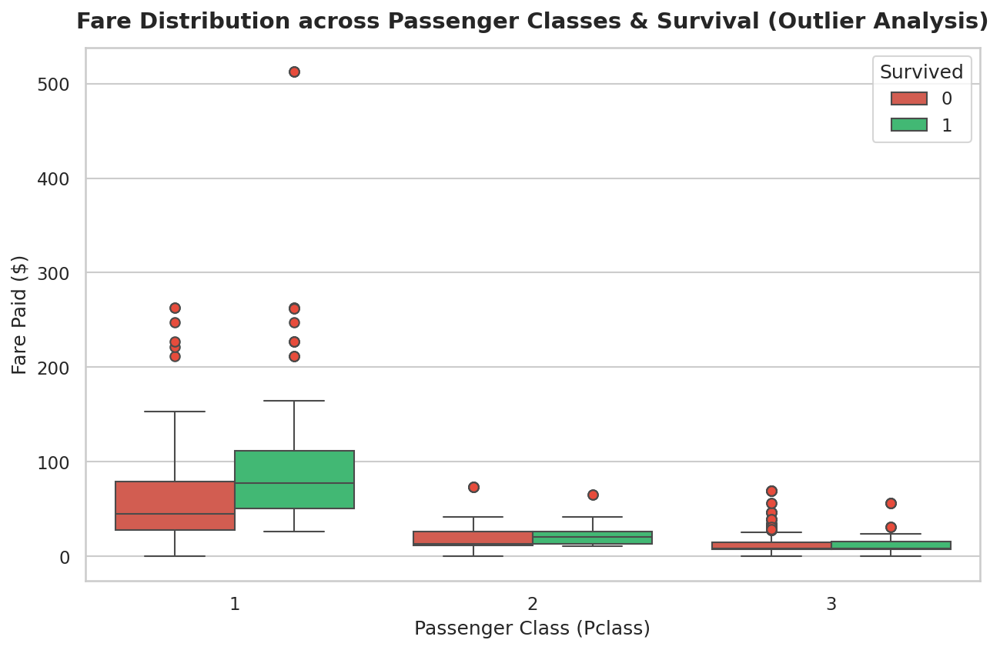
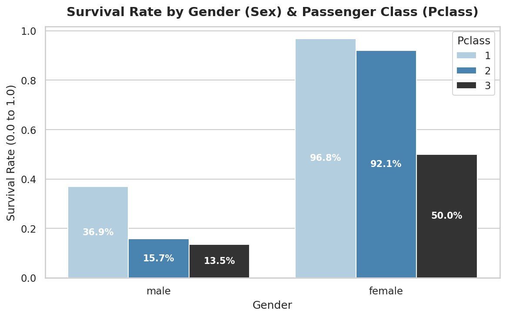

# 🚢 Neurofive Machine Learning Track

Welcome to the **Neurofive ML Track** repository maintained by **Rao Hamza Irshad**. This project demonstrates end-to-end Exploratory Data Analysis (EDA), missing value handling with statistical justifications, outlier detection, data storytelling, and feature importance analysis using the Kaggle Titanic dataset.

---

## 📌 Submission Matrix (Task-Wise Links)

| Track Task | Task Scope & Description | Direct Notebook Link |
| :--- | :--- | :--- |
| **Task 01** | **Baseline EDA & Setup:** Python environment setup, raw data ingestion, structural inspection (`.info()`, `.describe()`, `.head()`), feature classification (Numerical vs. Categorical), and executive Data Story. | 🔗 [**Task 1 Notebook**](tasks/Task-01-Baseline-EDA/Task_01_Titanic_EDA.ipynb) |
| **Task 02** | **Data Cleaning & Visual Storytelling:** Statistical missing value imputation (`fillna`), IQR outlier analysis, 4 Seaborn/Matplotlib visualizations, and formal survival driver analysis. | 🔗 [**Task 2 Notebook**](tasks/Task-02-Cleaning-and-Visualization/Task_02_Data_Cleaning_Visualizations.ipynb) |

---

## 📂 Professional Repository Architecture

```
neurofive-ml-track/
│
├── tasks/                                            # Modular Task Directory
│   ├── Task-01-Baseline-EDA/
│   │   └── Task_01_Titanic_EDA.ipynb                 # Task 1 Notebook
│   └── Task-02-Cleaning-and-Visualization/
│       └── Task_02_Data_Cleaning_Visualizations.ipynb# Task 2 Notebook
│
├── data/                                             # Raw & Processed Datasets
│   └── titanic.csv                                   # Titanic Dataset (891 rows x 12 columns)
│
├── assets/                                           # High-Resolution Visualization Assets
│   ├── age_distribution_histogram.png                # Histogram: Age vs Survival
│   ├── fare_outliers_boxplot.png                     # Boxplot: Fare Outliers & Class
│   ├── survival_rate_barchart.png                    # Bar Chart: Gender & Class Survival
│   └── correlation_heatmap.png                       # Heatmap: Feature Correlation Matrix
│
├── src/                                              # Reusable Code & Build Pipeline
│   └── generate_notebooks.py                         # Automation script for workspace builds
│
├── requirements.txt                                  # Project Dependencies
├── README.md                                         # Executive Repository Documentation
└── .gitignore                                        # Workspace Git Ignore Rules
```

---

## 🚀 Environment Setup & Quickstart

### Prerequisites
- Python **3.8+** installed.

### 1. Clone & Navigate
```bash
git clone https://github.com/MrRaoHamza/neurofive-ml-track.git
cd neurofive-ml-track
```

### 2. Install Dependencies
```bash
pip install -r requirements.txt
```

### 3. Run Notebooks
```bash
jupyter notebook tasks/Task-01-Baseline-EDA/Task_01_Titanic_EDA.ipynb
jupyter notebook tasks/Task-02-Cleaning-and-Visualization/Task_02_Data_Cleaning_Visualizations.ipynb
```

---

## 📊 Task 01: Baseline EDA & Executive Data Story

### Dataset Metrics:
- **Dimensions:** 891 rows × 12 columns
- **Numerical Features (7):** `PassengerId`, `Survived`, `Pclass`, `Age`, `SibSp`, `Parch`, `Fare`
- **Categorical Features (5):** `Name`, `Sex`, `Ticket`, `Cabin`, `Embarked`

### 📖 Executive Data Story:
> The Titanic dataset contains **891 rows** and **12 columns**, capturing passenger demographics, ticket details, and survival outcomes. Numerical features include `Age`, `Fare`, `SibSp`, `Parch`, `PassengerId`, `Pclass`, and `Survived`, while `Name`, `Sex`, `Ticket`, `Cabin`, and `Embarked` form the categorical attributes. Significant missing values exist in `Cabin` (77.10%) and `Age` (19.87%), with `Embarked` missing just 2 records. Key metrics reveal an overall survival rate of ~38.38% with passenger ages ranging from 0.42 to 80 years old (mean age ~29.7 years). The heavy missingness in `Cabin` suggests it may require indicator encoding, while `Age` will require median imputation prior to predictive modeling.

---

## 🧹 Task 02: Data Cleaning & Justifications (`fillna()` vs `dropna()`)

| Feature | Missing Count | Missing % | Cleaning Strategy | Formal Statistical Justification |
| :--- | :--- | :--- | :--- | :--- |
| **`Age`** | 177 | 19.87% | **`fillna(median)`** | `dropna()` would discard 20% of sample data. `Age` is right-skewed; median (~28.0 yrs) preserves sample size without being distorted by elderly outliers. |
| **`Embarked`** | 2 | 0.22% | **`fillna(mode)`** | Only 2 rows are missing. Imputing with the mode (`'S'`) restores complete cases with zero statistical bias. |
| **`Cabin`** | 687 | 77.10% | **`fillna('Unknown')` + `Cabin_Known`** | Over 77% missing. `dropna()` would destroy the dataset. We replace missing values with `'Unknown'` and construct a binary indicator (`Cabin_Known = 1/0`) to preserve the structural signal. |

---

## 🔍 Task 02: Outlier Detection (Interquartile Range - IQR Analysis)

Using boxplots on `Fare` across `Pclass`, we identified significant extreme value outliers:
- **First Quartile (Q1):** $7.91 | **Third Quartile (Q3):** $31.00 | **IQR:** $23.09
- **Upper Outlier Cutoff ($Q3 + 1.5 \times IQR$):** **$65.63**
- **Total Fare Outliers Detected:** **116 passengers** (13.02% of sample)
- **Maximum Fare Recorded:** **$512.33** (Paid by elite 1st Class passengers in luxury suites)

---

## 🎨 Visual Data Storytelling (4 Core Visualizations)

### 1. Age Distribution by Survival Outcome (Histogram)

*Insight:* Highlights child survival priority (<10 years old) and high mortality among young adults (20-30 years).

---

### 2. Fare Distribution & Outlier Detection (Boxplot)

*Insight:* Illustrates ticket price variance across classes and extreme fare outliers in 1st Class ($500+ fares).

---

### 3. Survival Rate by Gender & Passenger Class (Bar Chart)

*Insight:* Shows near-certain survival for 1st/2nd Class females (96.8% & 92.1%) vs stark 3rd Class male mortality (13.5%).

---

### 4. Feature Correlation Matrix (Heatmap)

*Insight:* Quantifies relationship strengths: `Sex_Numeric` (+0.54) and `Pclass` (-0.34) exhibit strongest correlations with `Survived`.

---

## ❓ Feature Importance Analysis

### **Question: Which feature do you think most affects survival, and why?**

### 💡 **Answer:**
**`Sex` (Gender)** is the single most decisive feature affecting survival, followed closely by **`Pclass` (Passenger Class)**.

#### **Empirical & Historical Evidence:**
1. **Gender Priority (`Sex`):** Females achieved a **74.2%** overall survival rate, whereas males recorded only **18.9%** (correlation **+0.54**). This was driven by the strict historical evacuation protocol: **"Women and children first"**.
2. **Socioeconomic Advantage (`Pclass`):** First-class passengers achieved a **62.9%** survival rate versus **24.2%** for 3rd class. First-class cabins were situated on upper decks directly adjacent to lifeboat launch stations.
3. **Compound Effect:** 1st-class females achieved a **96.8%** survival rate, while 3rd-class males suffered an **86.5% mortality rate**.

---

## 🎥 LinkedIn Presentation Guides

### Task 1 Walkthrough (2-3 mins):
- Introduce yourself and state your participation in the **Neurofive ML Track**.
- Show dataset loading and `.info()`, `.describe()`, and `.head()` outputs.
- Present your executive 5-6 line Data Story.

### Task 2 Walkthrough (2-3 mins):
- Explain your statistical data cleaning choices (`Age` median imputation, `Cabin_Known` binary feature).
- Walk through the **Survival Rate by Gender & Class Bar Chart** (96.8% 1st-class female survival vs 13.5% 3rd-class male survival).
- Summarize key insights and post on LinkedIn tagging **@Neurofive Solutions**!
