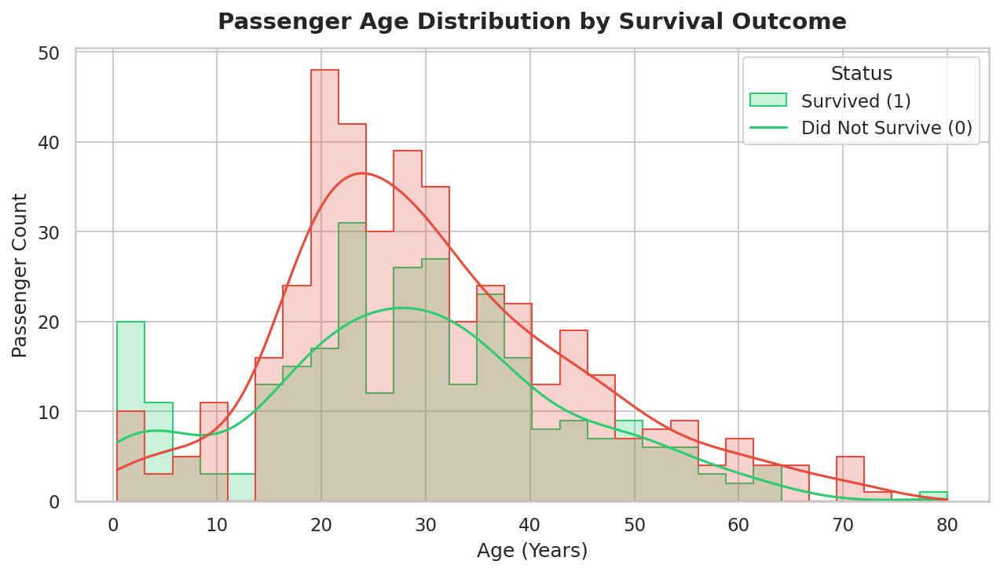
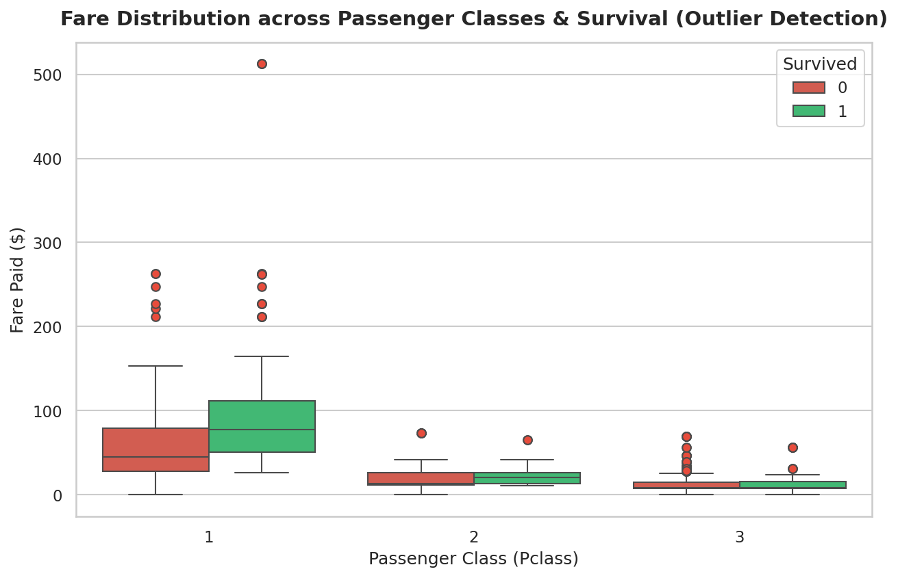
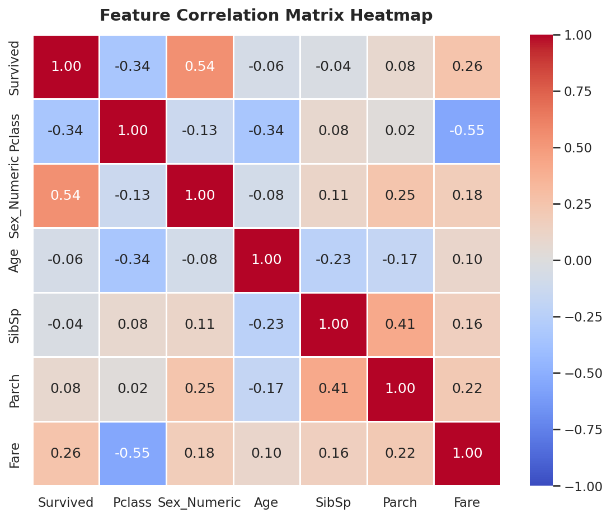

# 🚢 Neurofive ML Track - Titanic EDA & Data Cleaning

Welcome to the official repository for the **Neurofive ML Track** by **Rao Hamza Irshad**. This repository contains complete code, Jupyter notebooks, data cleaning scripts, visual data storytelling, and analytical reports for **Task 1** and **Task 2**.

---

## 🔗 Task Submission Links for Evaluators

| Task | Task Description | Direct Notebook Submission Link |
| :--- | :--- | :--- |
| **Task 1** | Python Environment Setup, Dataset Ingestion, Inspection (`.info()`, `.describe()`, `.head()`), Feature Classification & Baseline Data Story | 🔗 [**Task 1 Notebook (`Task1_Titanic_EDA.ipynb`)**](https://github.com/MrRaoHamza/neurofive-ml-track/blob/main/Task1_Titanic_EDA.ipynb) |
| **Task 2** | Data Cleaning (`fillna` justifications), Outlier Detection (Boxplot/IQR), 4 Visualizations (`matplotlib`/`seaborn`), Survival Feature Analysis | 🔗 [**Task 2 Notebook (`Task2_Data_Cleaning_Visualizations.ipynb`)**](https://github.com/MrRaoHamza/neurofive-ml-track/blob/main/Task2_Data_Cleaning_Visualizations.ipynb) |
| **Master** | Master Notebook combining Task 1 & Task 2 end-to-end | 🔗 [**Combined Master Notebook (`eda_titanic.ipynb`)**](https://github.com/MrRaoHamza/neurofive-ml-track/blob/main/eda_titanic.ipynb) |

---

## 📂 Repository Structure

```
neurofive-ml-track/
├── Task1_Titanic_EDA.ipynb                   # Dedicated Notebook for Task 1 Submission
├── Task2_Data_Cleaning_Visualizations.ipynb  # Dedicated Notebook for Task 2 Submission
├── eda_titanic.ipynb                         # Combined Master Notebook (Tasks 1 & 2)
├── titanic.csv                               # Kaggle Titanic Dataset (891 rows x 12 columns)
├── build_eda.py                              # Script to build EDA & generate plot artifacts
├── create_task_notebooks.py                  # Script generating task-wise notebooks
├── visualizations/                           # High-resolution chart exports (.png)
│   ├── plot1_age_histogram.png
│   ├── plot2_fare_boxplot.png
│   ├── plot3_survival_barchart.png
│   └── plot4_correlation_heatmap.png
├── README.md                                 # Complete project documentation & track guide
└── .gitignore                                # Git ignore rules for Python/Jupyter workspace
```

---

## ⚙️ Environment Setup & Quickstart

### Prerequisites
- Python 3.8+ installed on your system.

### 1. Clone & Navigate
```bash
git clone https://github.com/MrRaoHamza/neurofive-ml-track.git
cd neurofive-ml-track
```

### 2. Install Required Libraries
```bash
pip install pandas numpy matplotlib seaborn jupyter
```

### 3. Launch Notebooks
```bash
jupyter notebook Task1_Titanic_EDA.ipynb
# OR
jupyter notebook Task2_Data_Cleaning_Visualizations.ipynb
```

---

## 📊 Task 1: Baseline Exploratory Data Analysis & Data Story

### Dataset Metrics:
- **Total Rows (Observations):** 891
- **Total Columns (Features):** 12

### Feature Classification:
- **Numerical Features (7):** `PassengerId`, `Survived`, `Pclass`, `Age`, `SibSp`, `Parch`, `Fare`
- **Categorical Features (5):** `Name`, `Sex`, `Ticket`, `Cabin`, `Embarked`

### Initial Missing Values Overview:
- `Cabin`: **687 missing** (77.10%)
- `Age`: **177 missing** (19.87%)
- `Embarked`: **2 missing** (0.22%)

### 📖 Task 1 Data Story (Summary):
> The Titanic dataset contains **891 rows** and **12 columns**, capturing passenger demographics, ticket details, and survival outcomes. Numerical features include `Age`, `Fare`, `SibSp`, `Parch`, `PassengerId`, `Pclass`, and `Survived`, while `Name`, `Sex`, `Ticket`, `Cabin`, and `Embarked` form the categorical attributes. Significant missing values exist in `Cabin` (77.10%) and `Age` (19.87%), with `Embarked` missing just 2 records. Key metrics reveal an overall survival rate of ~38.38% with passenger ages ranging from 0.42 to 80 years old (mean age ~29.7 years). The heavy missingness in `Cabin` suggests it may require dropping or indicator encoding, while `Age` will require median/grouped imputation prior to predictive modeling.

---

## 🧹 Task 2: Data Cleaning & Written Justifications (`fillna()` vs `dropna()`)

Real-world data contains missing entries. Dropping rows blindly distorts sample sizes, while improper filling introduces bias.

| Feature | Missing Count | Missing % | Cleaning Strategy | Formal Justification |
| :--- | :--- | :--- | :--- | :--- |
| **`Age`** | 177 | 19.87% | **`fillna(median)`** | `dropna()` would discard 20% of sample data. `Age` is right-skewed; median (~28.0 yrs) preserves sample size without being pulled by elderly outliers. |
| **`Embarked`** | 2 | 0.22% | **`fillna(mode)`** | Only 2 rows are missing. Imputing with the mode (`'S'`) restores complete cases with zero statistical bias. |
| **`Cabin`** | 687 | 77.10% | **`fillna('Unknown')` + `Cabin_Known`** | Over 77% missing. `dropna()` would destroy the dataset. We replace missing values with `'Unknown'` and construct a binary indicator (`Cabin_Known = 1/0`) to capture the structural signal of recording cabin data. |

---

## 🔍 Task 2: Outlier Detection (IQR Analysis on `Fare`)

Using `sns.boxplot` on `Fare` across `Pclass`, we identified significant extreme value outliers:
- **First Quartile (Q1):** $7.91 | **Third Quartile (Q3):** $31.00 | **IQR:** $23.09
- **Upper Outlier Cutoff ($Q3 + 1.5 \times IQR$):** **$65.63**
- **Total Fare Outliers Detected:** **116 passengers** (13.02% of sample)
- **Maximum Fare Recorded:** **$512.33** (Paid by elite 1st Class passengers in luxury suites)

*Insight:* Extreme `Fare` outliers reflect genuine luxury accommodations (e.g., Cardeza & Widener suites) rather than data entry errors.

---

## 🎨 Task 2: Visual Data Storytelling (4 Core Visualizations)

### 1. Histogram: Age Distribution by Survival Outcome

*Insight:* Highlights child survival priority (<10 years old) and high mortality among young adults (20-30 years).

---

### 2. Boxplot: Fare Distribution & Outlier Detection

*Insight:* Illustrates ticket price variance across classes and extreme fare outliers in 1st Class ($500+ fares).

---

### 3. Bar Chart: Survival Rate by Gender & Passenger Class

*Insight:* Shows near-certain survival for 1st/2nd Class females (96.8% & 92.1%) vs stark 3rd Class male mortality (13.5%).

---

### 4. Correlation Matrix Heatmap

*Insight:* Quantifies relationship strengths: `Sex_Numeric` (+0.54) and `Pclass` (-0.34) exhibit strongest correlations with `Survived`.

---

## ❓ Feature Importance Analysis

### **Question: Which feature do you think most affects survival, and why?**

### 💡 **Answer:**
**`Sex` (Gender)** is the single most decisive feature affecting survival, followed closely by **`Pclass` (Passenger Class)**.

#### **Why? (Empirical & Historical Evidence):**
1. **Gender Priority (`Sex`):** Females achieved a **74.2%** overall survival rate, whereas males recorded only **18.9%** (correlation **+0.54**). This was driven by the strict enforcement of the historical maritime evacuation protocol: **"Women and children first"**.
2. **Socioeconomic Advantage (`Pclass`):** First-class passengers achieved a **62.9%** survival rate versus **24.2%** for 3rd class. First-class cabins were situated on upper decks directly adjacent to lifeboat launch stations.
3. **Compound Effect:** 1st-class females achieved a **96.8%** survival rate, while 3rd-class males suffered an **86.5% mortality rate**.

---

## 🎥 LinkedIn Presentation Guides

### Task 1 Walkthrough (2-3 mins):
- Introduce yourself and mention the **Neurofive ML Track**.
- Show dataset loading and `.info()`, `.describe()`, and `.head()` outputs.
- Read your 5-6 line Data Story summary cell.

### Task 2 Walkthrough (2-3 mins):
- Explain `fillna()` missing value choices (`Age` median, `Cabin_Known` indicator).
- Feature a surprising plot like the **Survival Rate by Gender & Class Bar Chart** (96.8% 1st-class female survival vs 13.5% 3rd-class male survival).
- Summarize why `Sex` and `Pclass` governed survival outcomes.
- Post on LinkedIn tagging **@Neurofive Solutions**!
