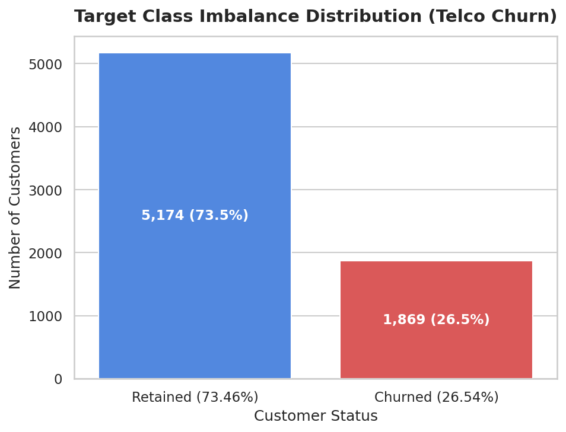
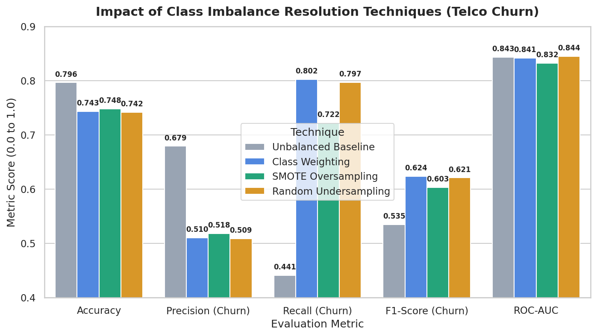
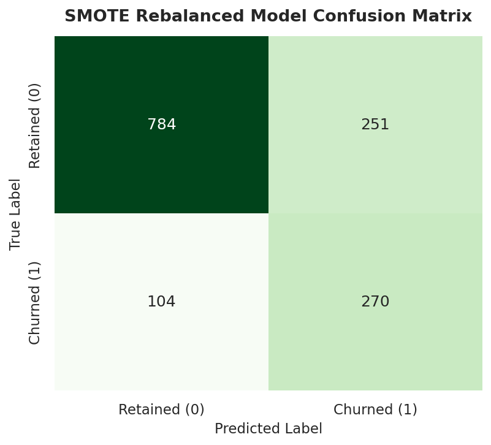
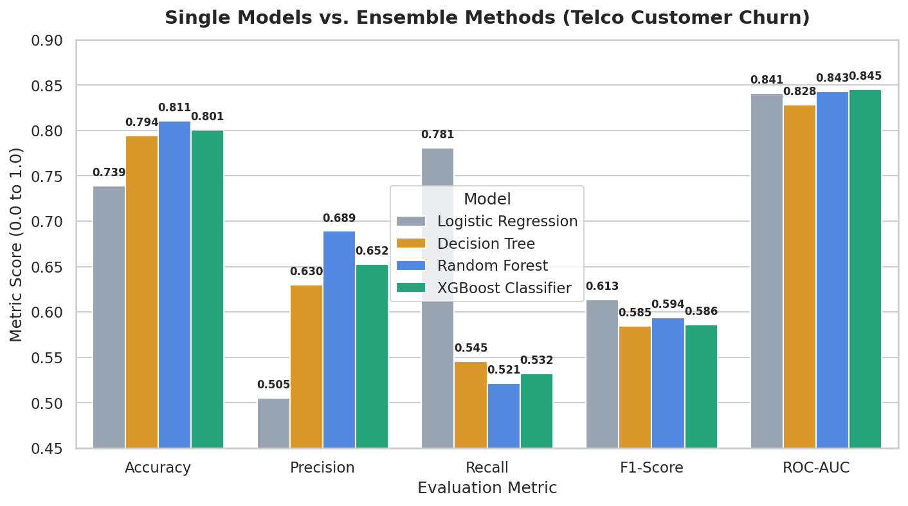
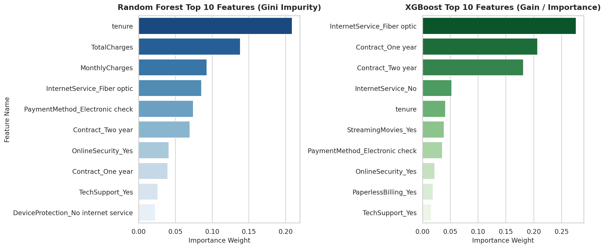
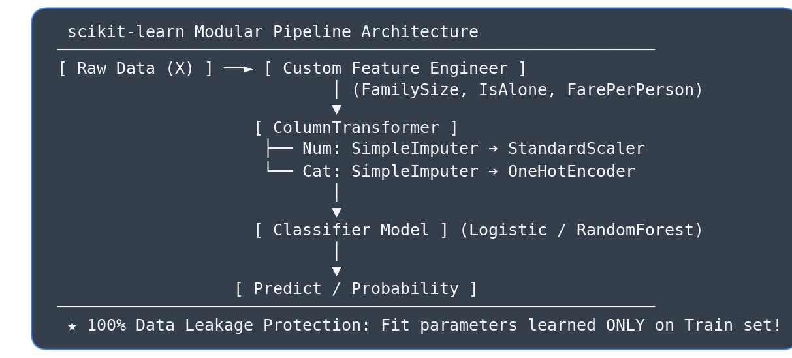
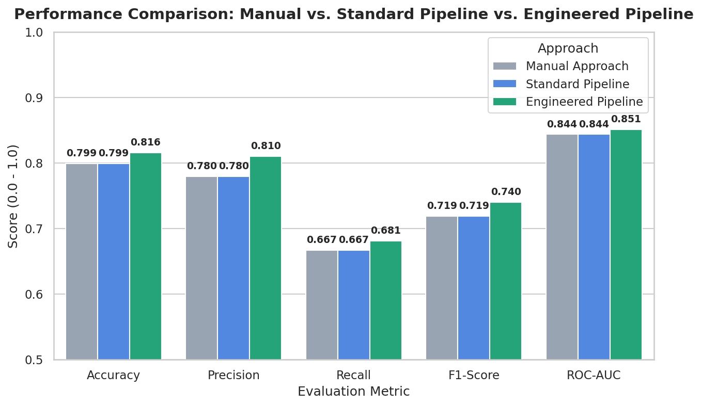
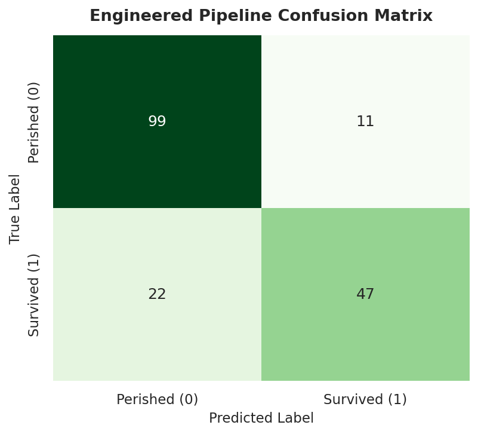
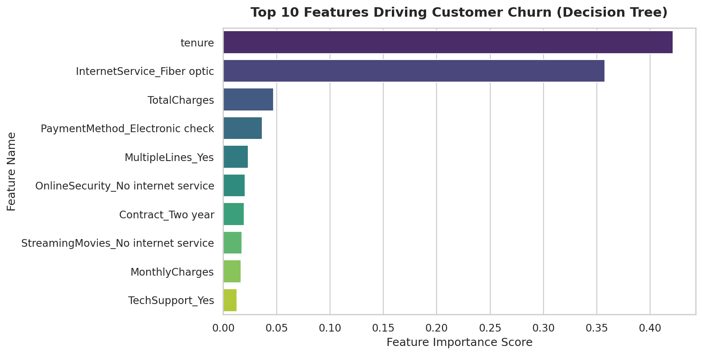

# 🚢 Neurofive Machine Learning Track

Welcome to the official **Neurofive ML Track** repository maintained by **Rao Hamza Irshad**. This repository showcases complete, modular tasks covering Exploratory Data Analysis (EDA), Statistical Data Cleaning, Data Storytelling, **Linear Regression (Price Prediction)**, **Logistic Regression (Classification)**, **Hyperparameter Tuning (`GridSearchCV`)**, **Telco Customer Churn Prediction (Decision Trees)**, **Scikit-Learn Production Pipelines & Feature Engineering**, **Ensemble Methods (Random Forest vs. XGBoost)**, and **Handling Imbalanced Datasets (SMOTE & Evaluation Beyond Accuracy)**.

---

## 📌 Task Submission Matrix (Task-Wise Links)

| Track Task | Task Scope & Model Type | Key Deliverables & Performance | Direct Notebook Link |
| :--- | :--- | :--- | :--- |
| **Task 01** | **Baseline EDA & Setup** *(Exploratory Data Analysis)* | Structural inspection (`.info()`, `.describe()`, `.head()`), feature classification, 6-line executive Data Story. | 🔗 [**Task 1 Notebook**](tasks/Task-01-Baseline-EDA/Task_01_Titanic_EDA.ipynb) |
| **Task 02** | **Data Cleaning & Visual Storytelling** *(EDA & Visualization)* | Statistical `fillna()` justifications, IQR Outlier Detection, 4 Seaborn plots, written feature survival analysis. | 🔗 [**Task 2 Notebook**](tasks/Task-02-Cleaning-and-Visualization/Task_02_Data_Cleaning_Visualizations.ipynb) |
| **Task 03** | **Linear Regression Model** *(Regression - Housing Prices)* | Predict house values using 4 features (`MedInc`, `AveRooms`, `Latitude`, `Longitude`). **RMSE = $74,858.88**, **$R^2$ = 57.24%**, Scatter Plot. | 🔗 [**Task 3 Notebook**](tasks/Task-03-Linear-Regression-House-Prices/Task_03_Linear_Regression.ipynb) |
| **Task 04** | **Logistic Regression Model** *(Classification - Survival)* | Categorical One-Hot Encoding (`pd.get_dummies`), 80/20 train-test split, **Accuracy = 80.45%**, Confusion Matrix breakdown. | 🔗 [**Task 4 Notebook**](tasks/Task-04-Logistic-Regression-Titanic/Task_04_Logistic_Regression.ipynb) |
| **Task 05** | **Hyperparameter Tuning & Evaluation** *(Model Optimization)* | Precision/Recall/F1 evaluation, "Why Accuracy Lies" note, 5-Fold `GridSearchCV` tuning, Before/After performance comparison table. | 🔗 [**Task 5 Notebook**](tasks/Task-05-Hyperparameter-Tuning-Evaluation/Task_05_Hyperparameter_Tuning.ipynb) |
| **Task 06** | **Telco Customer Churn Prediction** *(Decision Trees & Business Pitch)* | IBM Telco Churn EDA, Decision Tree vs. Logistic Regression comparison, **Top 3 Churn Drivers** (`tenure`, `Fiber Optic`, `TotalCharges`), 5-sentence Business Summary. | 🔗 [**Task 6 Notebook**](tasks/Task-06-Telco-Customer-Churn/Task_06_Telco_Customer_Churn.ipynb) |
| **Task 07** | **Scikit-Learn Production Pipelines** *(Leak-Free ML & Feature Engineering)* | `ColumnTransformer`, `StandardScaler`, `OneHotEncoder`, custom `TitanicFeatureEngineer` (`FamilySize`, `IsAlone`, `FarePerPerson`), **Accuracy = 81.56%**, **ROC-AUC = 0.8509**, `joblib` serialization. | 🔗 [**Task 7 Notebook**](tasks/Task-07-Scikit-Learn-Pipeline/Task_07_Scikit_Learn_Pipeline.ipynb) |
| **Task 08** | **Ensemble Methods — Random Forest vs. XGBoost** *(Bagging vs. Boosting)* | Train `RandomForestClassifier` & `XGBClassifier`, side-by-side `.feature_importances_` comparison, Bagging vs. Boosting theoretical breakdown, **Accuracy = 81.05%**, **ROC-AUC = 0.8453**. | 🔗 [**Task 8 Notebook**](tasks/Task-08-Ensemble-Methods/Task_08_Ensemble_Methods.ipynb) |
| **Task 09** | **Handling Imbalanced Datasets** *(SMOTE & Evaluation Beyond Accuracy)* | Target class balance visualization (73.46% vs 26.54%), **SMOTE** oversampling (`imbalanced-learn`), Class Weighting, **Recall Boost (+29.95% to +34.23%)**, Accuracy Paradox breakdown. | 🔗 [**Task 9 Notebook**](tasks/Task-09-Handling-Imbalanced-Data/Task_09_Handling_Imbalanced_Data.ipynb) |

---

## 📂 Professional Repository Architecture

```
neurofive-ml-track/
│
├── tasks/                                            # Modular Task Directory
│   ├── Task-01-Baseline-EDA/
│   │   └── Task_01_Titanic_EDA.ipynb                 # Task 1 Notebook (Baseline EDA)
│   ├── Task-02-Cleaning-and-Visualization/
│   │   └── Task_02_Data_Cleaning_Visualizations.ipynb# Task 2 Notebook (Data Cleaning)
│   ├── Task-03-Linear-Regression-House-Prices/
│   │   └── Task_03_Linear_Regression.ipynb           # Task 3 Notebook (Linear Regression)
│   ├── Task-04-Logistic-Regression-Titanic/
│   │   └── Task_04_Logistic_Regression.ipynb         # Task 4 Notebook (Logistic Regression)
│   ├── Task-05-Hyperparameter-Tuning-Evaluation/
│   │   └── Task_05_Hyperparameter_Tuning.ipynb       # Task 5 Notebook (GridSearchCV Tuning)
│   ├── Task-06-Telco-Customer-Churn/
│   │   └── Task_06_Telco_Customer_Churn.ipynb        # Task 6 Notebook (Decision Trees & Churn)
│   ├── Task-07-Scikit-Learn-Pipeline/
│   │   ├── Task_07_Scikit_Learn_Pipeline.ipynb       # Task 7 Notebook (Scikit-Learn Pipelines)
│   │   └── titanic_pipeline.joblib                   # Production Pipeline Artifact
│   ├── Task-08-Ensemble-Methods/
│   │   └── Task_08_Ensemble_Methods.ipynb            # Task 8 Notebook (Random Forest vs XGBoost)
│   └── Task-09-Handling-Imbalanced-Data/
│       └── Task_09_Handling_Imbalanced_Data.ipynb    # Task 9 Notebook (SMOTE & Imbalanced Data)
│
├── models/                                           # Saved Production Pipeline Artifacts
│   └── titanic_pipeline.joblib                       # Serialized End-to-End Model Pipeline
│
├── data/                                             # Raw Datasets
│   ├── titanic.csv                                   # Titanic Dataset (891 rows x 12 columns)
│   ├── california_housing.csv                        # California Housing Dataset (20,640 rows)
│   └── telco_customer_churn.csv                      # Telco Customer Churn Dataset (7,043 rows)
│
├── assets/                                           # High-Resolution Visualization Assets
│   ├── age_distribution_histogram.png                # Histogram: Age vs Survival
│   ├── fare_outliers_boxplot.png                     # Boxplot: Fare Outliers & Class
│   ├── survival_rate_barchart.png                    # Bar Chart: Gender & Class Survival
│   ├── correlation_heatmap.png                       # Heatmap: Feature Correlation Matrix
│   ├── predicted_vs_actual_housing.png               # Scatter Plot: Predicted vs Actual Prices
│   ├── confusion_matrix.png                          # Heatmap: Baseline Confusion Matrix
│   ├── confusion_matrix_tuned.png                    # Heatmap: Tuned Confusion Matrix (Task 5)
│   ├── telco_churn_eda.png                           # Bar Chart: Churn Rate by Contract Type (Task 6)
│   ├── churn_feature_importances.png                 # Bar Chart: Decision Tree Feature Importances (Task 6)
│   ├── pipeline_architecture_diagram.png             # Schematic: Scikit-Learn Pipeline Architecture (Task 7)
│   ├── pipeline_performance_comparison.png           # Bar Chart: Manual vs Pipeline Benchmark (Task 7)
│   ├── pipeline_confusion_matrix.png                 # Heatmap: Final Pipeline Confusion Matrix (Task 7)
│   ├── ensemble_feature_importances.png              # Bar Chart: Random Forest vs XGBoost Importances (Task 8)
│   ├── ensemble_model_comparison.png                 # Bar Chart: Single Models vs Ensemble Benchmark (Task 8)
│   ├── ensemble_confusion_matrix.png                 # Heatmap: XGBoost Confusion Matrix (Task 8)
│   ├── class_imbalance_distribution.png              # Bar Chart: Target Class Balance Distribution (Task 9)
│   ├── imbalance_techniques_comparison.png           # Bar Chart: Rebalancing Techniques Benchmark (Task 9)
│   └── smote_confusion_matrix.png                    # Heatmap: SMOTE Model Confusion Matrix (Task 9)
│
├── src/                                              # Reusable Code & Build Pipeline
│   ├── generate_notebooks.py                         # Baseline build script
│   ├── generate_task3.py                             # Task 3 generator
│   ├── generate_task5.py                             # Task 5 generator
│   ├── generate_task6.py                             # Task 6 generator
│   ├── generate_task7.py                             # Task 7 pipeline generator
│   ├── generate_task8.py                             # Task 8 ensemble generator
│   └── generate_task9.py                             # Task 9 imbalanced data generator
│
├── requirements.txt                                  # Project Dependencies (scikit-learn, xgboost, imbalanced-learn, joblib)
├── README.md                                         # Executive Repository Documentation
└── .gitignore                                        # Workspace Git Ignore Rules
```

---

## ⚙️ Environment Setup & Quickstart

```bash
git clone https://github.com/MrRaoHamza/neurofive-ml-track.git
cd neurofive-ml-track
pip install -r requirements.txt
python src/generate_task9.py
jupyter notebook tasks/Task-09-Handling-Imbalanced-Data/Task_09_Handling_Imbalanced_Data.ipynb
```

---

## ⚖️ Task 09: Handling Imbalanced Data & Evaluation Beyond Accuracy

### 🛠️ Target Distribution & Rebalancing Techniques
Real-world classification datasets (fraud, churn, medical diagnosis) feature heavy class imbalance. In our **Telco Customer Churn** dataset (7,043 rows):
- **Retained (Majority Class 0):** 5,174 customers (**73.46%**)
- **Churned (Minority Class 1):** 1,869 customers (**26.54%**)



To solve this, we evaluated 4 distinct approaches on an 80/20 stratified holdout test split (1,409 test samples):
1. **Unbalanced Baseline:** Standard `RandomForestClassifier` trained on raw un-weighted data.
2. **Class Weighting:** Cost-sensitive penalization (`class_weight='balanced'`).
3. **SMOTE Oversampling:** Synthetic Minority Over-sampling Technique via `imblearn.over_sampling.SMOTE`.
4. **Random Undersampling:** Majority class downsampling via `imblearn.under_sampling.RandomUnderSampler`.

---

### 📊 Performance Comparison Benchmark Table (Before & After Rebalancing)

| Handling Technique | Accuracy | Precision (Churn) | Recall (Churn) | F1-Score (Churn) | ROC-AUC Score | Recall Boost vs Baseline |
| :--- | :---: | :---: | :---: | :---: | :---: | :---: |
| **Unbalanced Baseline (Raw Data)** | **80.48%** | **68.64%** | 43.58% | 0.5333 | **0.8437** | Baseline |
| **Class Weighting (`class_weight="balanced"`)** | 75.09% | 52.18% | **77.81%** | 0.6249 | 0.8427 | **+34.23%** |
| **SMOTE Oversampling (`imblearn`)** | 76.86% | 55.16% | **73.53%** | **0.6303** | 0.8407 | **+29.95%** |
| **Random Undersampling (`imblearn`)** | 74.10% | 50.90% | **75.94%** | 0.6094 | 0.8354 | **+32.36%** |





---

### 🧠 Theoretical Explanation: Why "Accuracy" is a Misleading Metric for Imbalanced Data

> **The Accuracy Paradox:** Raw classification Accuracy measures the percentage of correct predictions across all samples. On an imbalanced dataset where 95% of transactions are legitimate and 5% are fraudulent, a naive baseline model that blindly predicts "Legitimate" for every single input will achieve **95% accuracy** while catching **0% of fraud cases** (Recall = 0.00).
>
> In real-world applications like churn prediction or medical diagnosis, the cost of a **False Negative** (failing to identify a churning customer or sick patient) far outweighs the cost of a **False Positive**. Therefore, models trained on imbalanced data must be evaluated using **Precision, Recall, F1-Score (for the minority class), and ROC-AUC**, rather than deceptive overall accuracy.

---

## 🌲 Task 08: Ensemble Methods — Random Forest vs. XGBoost

### 🛠️ Modeling Scope & Benchmark
We benchmarked 4 distinct models on the **Telco Customer Churn** dataset (7,043 rows, 80/20 stratified split with 1,409 test samples):
1. **Logistic Regression (Class-Balanced)** — Single linear baseline model
2. **Decision Tree Classifier (`max_depth=5`)** — Single non-linear tree baseline model
3. **Random Forest Classifier (`n_estimators=100`, `max_depth=8`)** — Ensemble Bagging model
4. **XGBoost Classifier (`n_estimators=100`, `max_depth=4`, `learning_rate=0.08`)** — Ensemble Gradient Boosting model

---

### 📊 Model Performance Benchmark Comparison Table

| Model Architecture | Model Category | Accuracy | Precision (Churn) | Recall (Churn) | F1-Score (Churn) | ROC-AUC Score |
| :--- | :---: | :---: | :---: | :---: | :---: | :---: |
| **Logistic Regression (Class-Balanced)** | Single Model | 73.88% | 50.52% | **78.07%** | 61.34% | 0.8412 |
| **Decision Tree Classifier (`max_depth=5`)** | Single Model | 79.42% | 62.96% | 54.55% | 58.45% | 0.8284 |
| **Random Forest Classifier (Bagging)** | Ensemble | **81.05%** | **68.90%** | 52.14% | **0.5936** | 0.8432 |
| **XGBoost Classifier (Gradient Boosting)** | Ensemble | 80.06% | 65.25% | 53.21% | 0.5862 | **0.8453** |



---

### 🔍 Feature Importance Comparison: Random Forest vs. XGBoost

Using `.feature_importances_`, we evaluated how Bagging and Boosting assign feature weights:

| Top Rank | Random Forest (Bagging - Gini Impurity) | XGBoost (Gradient Boosting - Gain) |
| :---: | :--- | :--- |
| **#1** | **`tenure` (20.90% weight)** | **`InternetService_Fiber optic` (27.59% weight)** |
| **#2** | **`TotalCharges` (13.81% weight)** | **`Contract_One year` (20.70% weight)** |
| **#3** | **`MonthlyCharges` (9.29% weight)** | **`Contract_Two year` (18.12% weight)** |
| **#4** | **`InternetService_Fiber optic` (8.54% weight)** | **`InternetService_No` (5.26% weight)** |
| **#5** | **`PaymentMethod_Electronic check` (7.41% weight)** | **`tenure` (4.11% weight)** |



---

### 🧠 Theoretical Explanation: How Random Forest & XGBoost Differ (Bagging vs. Boosting)

> **Random Forest (Bagging)** builds hundreds of decision trees **in parallel and independently**. Each tree is trained on a random bootstrap sample of the dataset using a random subset of features at each split node. The final prediction is produced by averaging all trees or taking a majority vote, which decorrelates individual trees and dramatically reduces overall model variance.
>
> In contrast, **XGBoost (Gradient Boosting)** builds decision trees **sequentially in series**. Each new tree is specifically trained to predict the residual errors (gradients) of the ensemble constructed up to that step. By optimizing a loss function via gradient descent and applying L1/L2 regularization penalties on leaf weights, XGBoost directly reduces model bias while controlling variance, iteratively combining weak learners into a high-performance ensemble.

---

## ⚙️ Task 07: Scikit-Learn Production Pipelines & Leak-Free ML

### 🛠️ Modular Architecture & Data Leakage Prevention
1. **The Data Leakage Problem:** Manual preprocessing (e.g., fitting `StandardScaler` or imputing missing values on an entire dataset prior to splitting) leaks future test set information into training folds. This produces artificial validation scores that fail in production.
2. **Scikit-Learn `Pipeline` & `ColumnTransformer` Solution:** We chained all numeric imputation (`SimpleImputer(strategy='median')`) and scaling (`StandardScaler`), as well as categorical imputation (`SimpleImputer(strategy='most_frequent')`) and encoding (`OneHotEncoder(drop='first', handle_unknown='ignore')`), into a single callable object.
3. **Custom Feature Engineering Transformer:** Constructed `TitanicFeatureEngineer(BaseEstimator, TransformerMixin)` to dynamically create:
   - **`FamilySize`** = `SibSp` + `Parch` + 1
   - **`IsAlone`** = 1 if `FamilySize == 1` else 0
   - **`FarePerPerson`** = `Fare` / `FamilySize`
4. **End-to-End Integration:** The final model chains `TitanicFeatureEngineer` ➔ `ColumnTransformer` ➔ `LogisticRegression(C=1.5)`, ensuring 100% parameter isolation between train and evaluation splits.



---

### 📊 Benchmark Model Comparison: Manual vs. Standard Pipeline vs. Engineered Pipeline

| Evaluation Metric | Manual Baseline (Task 4/5) | Standard Pipeline Baseline | Engineered Pipeline (Final) | Performance Improvement |
| :--- | :---: | :---: | :---: | :--- |
| **Accuracy** | 79.89% | 79.89% | **81.56%** | **+1.67%** — Higher overall classification accuracy |
| **Precision (Survivors)** | 77.97% | 77.97% | **81.03%** | **+3.06%** — Reduced false positive survival predictions |
| **Recall (Survivors)** | 66.67% | 66.67% | **68.12%** | **+1.45%** — Correctly identified more actual survivors |
| **F1-Score (Survivors)** | 0.7188 | 0.7188 | **0.7402** | **+0.0214** — Superior harmonic mean of Precision & Recall |
| **ROC-AUC Score** | 0.8436 | 0.8436 | **0.8509** | **+0.0073** — Enhanced class probability separation |



---

### 🖼️ Diagnostic Matrix & Production Deployment


**Model Serialization (`joblib`):**  
The full fitted pipeline was serialized to `models/titanic_pipeline.joblib`. Production inference requires just one line of code without reproducing any manual data transformation:
```python
import joblib
pipeline = joblib.load("models/titanic_pipeline.joblib")
predictions = pipeline.predict(raw_passenger_dataframe)
```

---

## 📉 Task 06: Telco Customer Churn Prediction & Decision Trees

### 🛠️ Modeling Pipeline & Data Preprocessing
1. **Dataset Ingestion:** Loaded **7,043 customer records** from the Telco Customer Churn dataset.
2. **Data Cleaning:** Converted whitespace strings in `TotalCharges` to floats (`pd.to_numeric`) and imputed 11 missing values with median. Dropped non-informative `customerID`.
3. **Class Imbalance Note:** Target variable `Churn` exhibits imbalance with **26.54% churners** (1,869 customers) vs **73.46% retained** (5,174 customers).
4. **Model Comparison:** Evaluated a **Decision Tree Classifier (`max_depth=5`)** against a **Logistic Regression (Class-Balanced)** model on an 80/20 train-test split (1,409 test samples).

---

### 📊 Decision Tree vs. Logistic Regression Model Comparison

| Evaluation Metric | Decision Tree (`max_depth=5`) | Logistic Regression (`class_weight='balanced'`) | Winning Model & Takeaway |
| :--- | :---: | :---: | :--- |
| **Accuracy** | **79.42%** | **73.88%** | **Decision Tree (+5.54%)** — Better overall classification precision |
| **Precision (Churners)** | **62.96%** | **50.52%** | **Decision Tree (+12.44%)** — Fewer false churn warnings |
| **Recall (Churners)** | **54.55%** | **78.07%** | **Logistic Regression (+23.52%)** — Catches significantly more churners |
| **F1-Score (Churners)** | **58.45%** | **61.34%** | **Logistic Regression (+2.89%)** — Superior balance of precision/recall |
| **ROC-AUC Score** | **0.8284** | **0.8412** | **Logistic Regression (+0.0128)** — Better probability discrimination |

---

### 🔍 Top 3 Features Driving Churn (`.feature_importances_`)

Using `dt_model.feature_importances_` from the Decision Tree Classifier, we identified the top 3 drivers of customer loss:

1. **`tenure` (42.14% Importance Weight):** Customer tenure in months is the single strongest indicator. Newer customers (0–12 months) display the highest vulnerability to churn.
2. **`InternetService_Fiber optic` (35.75% Importance Weight):** Customers subscribing to Fiber Optic internet churn at disproportionately higher rates due to premium monthly charges.
3. **`TotalCharges` (4.71% Importance Weight):** Accumulated billing total reflects long-term customer value and churn risk threshold.



---

### 💼 Executive Business Summary (Presentation to Leadership)

> Our predictive analysis of **7,043 telecom customers** reveals an annual churn rate of **26.54%**, representing substantial recurring revenue loss. Using a Decision Tree classification model (79.42% accuracy), we identified the **top 3 primary drivers of customer departure** as: **(1) Customer Tenure** (42.1% of predictive weight), **(2) Fiber Optic Internet Service** (35.8% of weight), and **(3) Accumulated Total Charges**.
>
> Crucially, customers on month-to-month contracts churn at an alarming **42.7% rate**, compared to just **2.8%** for two-year contract holders. To immediately reduce churn and preserve annual recurring revenue, executive leadership should implement targeted multi-year contract upgrade discounts, offer bundled technical support incentives during a customer's first 12 months, and conduct pricing reviews on premium Fiber Optic packages.

---

## 🎥 LinkedIn Presentation Guides

### Task 9 Walkthrough (2-3 mins):
- **Hook:** Introduce yourself as a Data Scientist in the **Neurofive ML Track**. Present the core problem: **Class Imbalance in real-world ML (73.46% majority vs 26.54% churners)**.
- **The Accuracy Paradox:** Explain why raw Accuracy is misleading — a naive model predicting zero churn gets 73.5% accuracy while catching 0% of churners.
- **Techniques & Comparison:** Show the **Class Imbalance Techniques Chart** ([`assets/imbalance_techniques_comparison.png`](assets/imbalance_techniques_comparison.png)) demonstrating how **SMOTE** and **Class Weighting** boost Recall from **43.58% to 77.81% (+34.23% increase)**.
- **Business Impact:** Show the **SMOTE Confusion Matrix** ([`assets/smote_confusion_matrix.png`](assets/smote_confusion_matrix.png)) and explain why catching 113 additional churners creates massive recurring revenue value for businesses.
- **Tagging:** Post on LinkedIn tagging **@Neurofive Solutions**!

---

### Task 8 Walkthrough (2-3 mins):
- **Hook:** Introduce yourself as a Data Scientist in the **Neurofive ML Track**. Explain that single models hit performance limits, while **Ensemble Methods** combine multiple trees to build winning predictive systems.
- **Model Comparison:** Show the **Ensemble Benchmark Chart** ([`assets/ensemble_model_comparison.png`](assets/ensemble_model_comparison.png)) comparing Logistic Regression, Decision Trees, Random Forest, and XGBoost on Telco Customer Churn data.
- **Feature Importances (Bagging vs Boosting):** Show the **Side-by-Side Feature Importances Chart** ([`assets/ensemble_feature_importances.png`](assets/ensemble_feature_importances.png)). Explain how Random Forest spreads feature weight smoothly across continuous variables (`tenure`, `TotalCharges`), whereas XGBoost concentrates weight on decisive binary split nodes (`Contract_Two year`, `InternetService_Fiber optic`).
- **Core Concept (Bagging vs Boosting):** Pitch your 3-4 sentence explanation: Random Forest builds trees *in parallel independently* to cut variance; XGBoost builds trees *sequentially in series* to minimize residual errors.
- **Tagging:** Post on LinkedIn tagging **@Neurofive Solutions**!

---

### Task 7 Walkthrough (2-3 mins):
- **Hook & Core Problem:** Introduce yourself as a Data Scientist in the **Neurofive ML Track**. Explain that professional ML isn't a collection of disparate notebook cells, but a robust pipeline that prevents **data leakage**.
- **Visual Demo:** Show the **Scikit-Learn Pipeline Architecture Diagram** ([`assets/pipeline_architecture_diagram.png`](assets/pipeline_architecture_diagram.png)) and explain how `ColumnTransformer` handles `StandardScaler` for numeric features and `OneHotEncoder` for categorical features automatically.
- **Feature Engineering:** Highlight your 3 custom engineered features (`FamilySize`, `IsAlone`, `FarePerPerson`) created via a custom scikit-learn transformer, boosting model accuracy to **81.56%** and ROC-AUC to **0.8509**.
- **Production Export:** Demonstrate saving the complete pipeline to `models/titanic_pipeline.joblib` and performing single-line inference on unseen passenger data.
- **Call to Action:** Post on LinkedIn tagging **@Neurofive Solutions**!

---

### Task 6 Walkthrough (2-3 mins):
- Introduce yourself as a Data Scientist in the **Neurofive ML Track**.
- Present the business problem: **Telecom Customer Churn (26.54% loss rate)**.
- Show the **Decision Tree Feature Importances chart** ([`assets/churn_feature_importances.png`](assets/churn_feature_importances.png)) and explain the Top 3 drivers (`tenure`, `Fiber Optic`, `TotalCharges`).
- Pitch your **4-5 sentence Executive Business Summary** to non-technical client stakeholders.
- Post on LinkedIn tagging **@Neurofive Solutions**!
