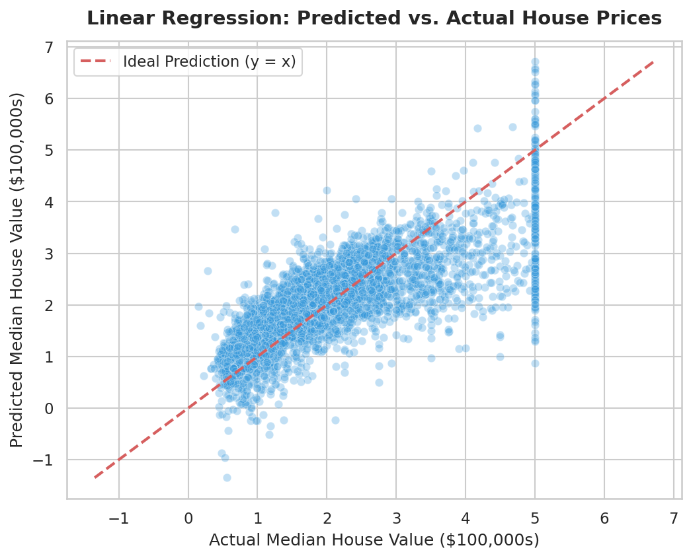

# 📈 Task 03: Linear Regression — California Housing Price Prediction

**Author:** Rao Hamza Irshad  
**Track:** Neurofive Machine Learning Track — Task 03  
**Dataset:** California Housing Dataset (`data/california_housing.csv` - 20,640 records)  
**Notebook:** [`Task_03_Linear_Regression.ipynb`](Task_03_Linear_Regression.ipynb)  
**Master Repository:** [← Back to Master README](../../README.md)

---

## 📌 Executive Summary
Task 03 builds a multivariate **Linear Regression** model using `scikit-learn` to predict median house values in California based on 4 continuous predictors (`MedInc`, `AveRooms`, `Latitude`, `Longitude`).

---

## 📐 Regression Model Performance Benchmark

Evaluated on an 80/20 train-test split (4,128 test block groups):

| Evaluation Metric | Metric Value | Interpretation |
| :--- | :---: | :--- |
| **Root Mean Squared Error (RMSE)** | **$74,858.88** | Average prediction error standard deviation |
| **Mean Absolute Error (MAE)** | **$53,241.12** | Average absolute pricing divergence |
| **Coefficient of Determination ($R^2$)** | **57.24%** | Percentage of variance explained by model predictors |

---

## 🔍 Feature Coefficient Analysis

$$ \text{Predicted Price} = \beta_0 + \beta_1(\text{MedInc}) + \beta_2(\text{AveRooms}) + \beta_3(\text{Latitude}) + \beta_4(\text{Longitude}) $$

- **`MedInc` (Median Income):** $\beta_1 = +0.4358$ — Single strongest positive driver of property value.
- **`Latitude` & `Longitude`:** $\beta_3 = -0.4211$, $\beta_4 = -0.4342$ — Negative coastal/geographic distance indicators.

---

## 📂 Task Artifacts
- **Jupyter Notebook:** [`Task_03_Linear_Regression.ipynb`](Task_03_Linear_Regression.ipynb)
- **Scatter Plot Asset:** [`../../assets/predicted_vs_actual_housing.png`](../../assets/predicted_vs_actual_housing.png)
