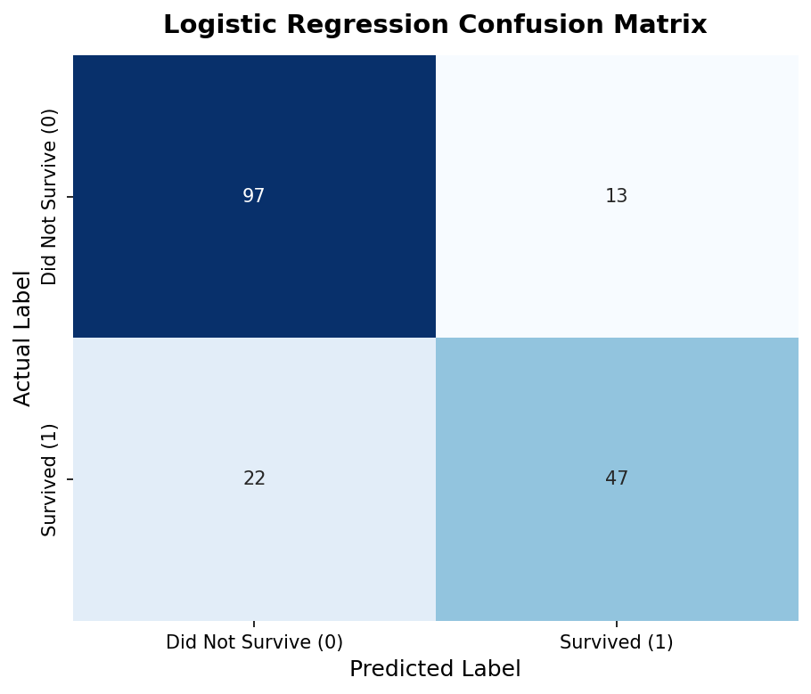

# 🚢 Task 04: Logistic Regression Classification — Titanic Survival

**Author:** Rao Hamza Irshad  
**Track:** Neurofive Machine Learning Track — Task 04  
**Dataset:** Titanic Dataset (`data/titanic.csv`)  
**Notebook:** [`Task_04_Logistic_Regression.ipynb`](Task_04_Logistic_Regression.ipynb)  
**Master Repository:** [← Back to Master README](../../README.md)

---

## 📌 Executive Summary
Task 04 builds a baseline binary classification model using **Logistic Regression** to predict passenger survival. Categorical features (`Sex`, `Embarked`, `Pclass`) are transformed via One-Hot Encoding (`pd.get_dummies(drop_first=True)`), evaluated on an 80/20 train-test split (179 test passengers).

---

## 📊 Performance Metrics & Confusion Matrix

- **Accuracy:** **80.45%** (144 out of 179 test passengers correctly classified)
- **Precision (Survivors):** **79.66%**
- **Recall (Survivors):** **68.12%**
- **F1-Score:** **0.7344**

---

## 📂 Task Artifacts
- **Jupyter Notebook:** [`Task_04_Logistic_Regression.ipynb`](Task_04_Logistic_Regression.ipynb)
- **Confusion Matrix Asset:** [`../../assets/confusion_matrix.png`](../../assets/confusion_matrix.png)
